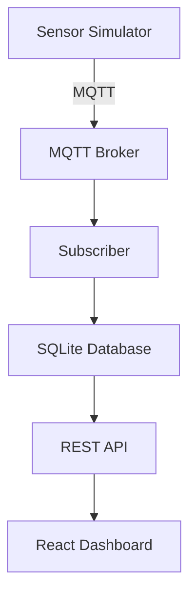

# Sistema IoT - Manutenção Preditiva

Sistema completo de monitoramento IoT para manutenção preditiva de máquinas industriais, composto por simulador de sensores, API REST e dashboard web em tempo real.


## 🚀 Visão Geral

O sistema simula máquinas industriais com sensores que enviam dados via MQTT. Uma API REST fornece acesso aos dados armazenados em SQLite, e um dashboard web exibe informações em tempo real com sistema de alertas baseado em thresholds.

## 🏗️ Arquitetura



## 🔧 Tecnologias

### Backend
- **Python** - Simulação de sensores e coleta de dados
- **MQTT** - Comunicação IoT
- **SQLite** - Armazenamento local
- **ASP.NET Core** - API REST
- **Entity Framework** - ORM

### Frontend
- **React 18** - Interface de usuário
- **TypeScript** - Type safety
- **Tailwind CSS** - Estilização
- **Webpack** - Build system

## 📊 Dados Monitorados

| Sensor | Faixa | Normal | Alerta | Crítico |
|--------|-------|--------|--------|---------|
| **Vibração** | 8.0-15.0 | ≤ 10.0 | 10.1-12.0 | > 12.0 |
| **Temperatura** | 45-70°C | ≤ 55°C | 55.1-60°C | > 60°C |
| **Pressão** | 4.0-6.0 bar | ≤ 5.0 | 5.1-5.5 | > 5.5 |
| **Umidade** | 30-80% | - | - | - |
| **Tensão** | 220-240V | - | - | - |
| **Corrente** | 5-20A | - | - | - |
| **Potência** | 1-5kW | - | - | - |

## 🚀 Início Rápido

### Pré-requisitos

```bash
# Python 3.8+
python --version

# .NET 8.0+
dotnet --version

# Node.js 18+
node --version

# MQTT Broker (Ubuntu/Debian)
sudo apt install mosquitto mosquitto-clients
sudo systemctl start mosquitto
```

### 1. Clonar o Repositório
```bash
git clone <repository-url>
cd ManutencaoPreditiva
```

### 2. Iniciar o Simulador
```bash
# Terminal 1 - Subscriber
cd src/simulator
pip install paho-mqtt
python subscriber.py

# Terminal 2 - Sensor Simulator
cd src/simulator
python sensor_simulator.py
```

### 3. Iniciar a API
```bash
# Terminal 3
cd src/api/IoTDataApi
dotnet restore
dotnet run
```

### 4. Iniciar o Frontend
```bash
# Terminal 4
cd src/client/iot-dashboard
npm install
npm start
```

### 5. Acessar o Dashboard
```
http://localhost:8080
```

## 📁 Estrutura do Projeto

```
ManutencaoPreditiva/
├── src/
│   ├── simulator/                 # Simulação IoT
│   │   ├── sensor_simulator.py    # Gerador de dados
│   │   ├── subscriber.py          # Consumidor MQTT
│   │   └── iot.db                # Banco SQLite
│   ├── api/
│   │   └── IoTDataApi/           # API REST .NET
│   │       ├── Controllers/
│   │       ├── Data/
│   │       └── Program.cs
│   └── client/
│       └── iot-dashboard/        # Frontend React
│           ├── src/
│           └── public/
├── README.md                     # Este arquivo
└── .gitignore
```

## 🌐 Endpoints da API

### Base URL: `http://localhost:5000`

| Método | Endpoint | Descrição |
|--------|----------|-----------|
| GET | `/api/iot` | Todos os dados (últimos 100) |
| GET | `/api/iot/machine/{id}` | Dados de máquina específica |

### Exemplo de Response
```json
{
  "id": 769,
  "topic": "sensors/M1/data",
  "message": "{\"machine_id\":\"M1\",\"vibration\":10.25,...}",
  "receivedAt": "2025-08-19T19:58:30.804525Z"
}
```

## 🖥️ Interface do Dashboard

### Funcionalidades
- ✅ **Monitoramento em Tempo Real** - Atualização a cada 5 segundos
- ✅ **Sistema de Alertas Visuais** - Cores baseadas em thresholds
- ✅ **Layout Responsivo** - Mobile, tablet e desktop
- ✅ **Estados de Loading/Error** - UX aprimorada
- ✅ **Informações Completas** - Todos os sensores visíveis

### Status das Máquinas
- 🟢 **NORMAL** - Todos os parâmetros dentro do esperado
- 🟡 **ALERTA** - Um ou mais parâmetros em zona de atenção
- 🔴 **CRÍTICO** - Parâmetros acima dos thresholds seguros

## 🔍 Monitoramento e Logs

### Verificar Status dos Serviços
```bash
# MQTT Broker
sudo systemctl status mosquitto

# Dados no banco
sqlite3 src/simulator/iot.db "SELECT COUNT(*) FROM iot_data;"

# API funcionando
curl http://localhost:5000/api/iot/machine/M1

# Frontend
# Acessar http://localhost:8080
```

### Logs Importantes
- **Simulator:** Conexão MQTT e publicação de dados
- **Subscriber:** Recebimento e armazenamento no banco
- **API:** Requests e conexão com banco
- **Frontend:** Console do navegador (F12)

## 🛠️ Troubleshooting

### Problema: Tela em branco no frontend
**Soluções:**
1. Verificar se API está rodando (porta 5000)
2. Verificar CORS na API
3. Abrir console do navegador (F12) para erros

### Problema: "Aguardando dados..." nos cards
**Soluções:**
1. Verificar se simulador está rodando
2. Confirmar dados no SQLite
3. Testar API diretamente

### Problema: Erro de conexão MQTT
**Soluções:**
```bash
sudo systemctl restart mosquitto
mosquitto_pub -h localhost -t "test" -m "hello"
```

### Problema: API não encontra banco
**Soluções:**
1. Executar subscriber.py primeiro
2. Verificar caminho do banco no Program.cs
3. Verificar permissões de arquivo

## 📈 Próximos Passos

### Funcionalidades Planejadas
- [ ] **Histórico de Dados** - Gráficos temporais
- [ ] **Alertas por Email** - Notificações automáticas
- [ ] **Machine Learning** - Predição de falhas
- [ ] **Relatórios** - Exportação de dados
- [ ] **Autenticação** - Login de usuários
- [ ] **Multi-tenancy** - Suporte a múltiplas plantas

### Melhorias Técnicas
- [ ] **Docker** - Containerização completa
- [ ] **CI/CD** - Pipeline automatizado
- [ ] **Testes** - Cobertura de testes
- [ ] **Monitoring** - APM e observabilidade
- [ ] **Scaling** - Suporte a mais máquinas

## 🤝 Contribuição

1. Fork o projeto
2. Crie uma branch para sua feature (`git checkout -b feature/AmazingFeature`)
3. Commit suas mudanças (`git commit -m 'Add some AmazingFeature'`)
4. Push para a branch (`git push origin feature/AmazingFeature`)
5. Abra um Pull Request

## 📝 Licença

Este projeto está sob a licença MIT. Veja o arquivo `LICENSE` para mais detalhes.

## 📞 Suporte

Para suporte, abra uma issue no repositório ou entre em contato:
- 📧 Email: [seu-email@exemplo.com]
- 💬 Discord: [link-do-discord]
- 📚 Wiki: [link-da-wiki]
