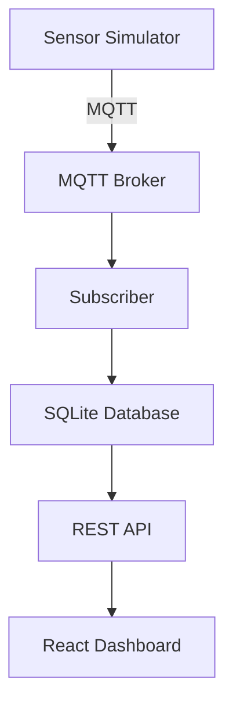

# IoT System - Predictive Maintenance

Complete IoT monitoring system for predictive maintenance of industrial machinery, featuring sensor simulator, REST API, and real-time web dashboard.


## Overview

The system simulates industrial machines with sensors that send data via MQTT. A REST API provides access to data stored in SQLite, and a web dashboard displays real-time information with threshold-based alert system.

## Architecture



## 🔧 Technologies

### Backend
- **Python** - Sensor simulation and data collection
- **MQTT** - IoT communication
- **SQLite** - Local storage
- **ASP.NET Core** - REST API
- **Entity Framework** - ORM

### Frontend
- **React 18** - User interface
- **TypeScript** - Type safety
- **Tailwind CSS** - Styling
- **Webpack** - Build system

## Monitored Data

| Sensor | Range | Normal | Alert | Critical |
|--------|-------|--------|--------|---------|
| **Vibration** | 8.0-15.0 | ≤ 10.0 | 10.1-12.0 | > 12.0 |
| **Temperature** | 45-70°C | ≤ 55°C | 55.1-60°C | > 60°C |
| **Pressure** | 4.0-6.0 bar | ≤ 5.0 | 5.1-5.5 | > 5.5 |
| **Humidity** | 30-80% | - | - | - |
| **Voltage** | 220-240V | - | - | - |
| **Current** | 5-20A | - | - | - |
| **Power** | 1-5kW | - | - | - |

## Quick Start

### Prerequisites

```bash
# Python 3.8+
python --version

# .NET 8.0+
dotnet --version

# Node.js 18+
node --version

# MQTT Broker (Ubuntu/Debian)
sudo apt install mosquitto mosquitto-clients
sudo systemctl start mosquitto
```

### 1. Clone Repository
```bash
git clone <repository-url>
cd ManutencaoPreditiva
```

### 2. Start Simulator
```bash
# Terminal 1 - Subscriber
cd src/simulator
pip install paho-mqtt
python subscriber.py

# Terminal 2 - Sensor Simulator
cd src/simulator
python sensor_simulator.py
```

### 3. Start API
```bash
# Terminal 3
cd src/api/IoTDataApi
dotnet restore
dotnet run
```

### 4. Start Frontend
```bash
# Terminal 4
cd src/client/iot-dashboard
npm install
npm start
```

### 5. Access Dashboard
```
http://localhost:8080
```

## Project Structure

```
ManutencaoPreditiva/
├── src/
│   ├── simulator/                 # IoT Simulation
│   │   ├── sensor_simulator.py    # Data generator
│   │   ├── subscriber.py          # MQTT consumer
│   │   └── iot.db                # SQLite database
│   ├── api/
│   │   └── IoTDataApi/           # .NET REST API
│   │       ├── Controllers/
│   │       ├── Data/
│   │       └── Program.cs
│   └── client/
│       └── iot-dashboard/        # React Frontend
│           ├── src/
│           └── public/
├── README.md                     # This file
└── .gitignore
```

## API Endpoints

### Base URL: `http://localhost:5000`

| Method | Endpoint | Description |
|--------|----------|-----------|
| GET | `/api/iot` | All data (last 100 records) |
| GET | `/api/iot/machine/{id}` | Specific machine data |

### Example Response
```json
{
  "id": 769,
  "topic": "sensors/M1/data",
  "message": "{\"machine_id\":\"M1\",\"vibration\":10.25,...}",
  "receivedAt": "2025-08-19T19:58:30.804525Z"
}
```

## 🖥️ Dashboard Interface

### Features
- ✅ **Real-time Monitoring** - Updates every 5 seconds
- ✅ **Visual Alert System** - Color-coded thresholds
- ✅ **Responsive Layout** - Mobile, tablet and desktop
- ✅ **Loading/Error States** - Enhanced UX
- ✅ **Complete Information** - All sensors visible

### Machine Status
- 🟢 **NORMAL** - All parameters within expected range
- 🟡 **ALERT** - One or more parameters in attention zone
- 🔴 **CRITICAL** - Parameters above safe thresholds

## 🔍 Monitoring and Logs

### Check Service Status
```bash
# MQTT Broker
sudo systemctl status mosquitto

# Database data
sqlite3 src/simulator/iot.db "SELECT COUNT(*) FROM iot_data;"

# API status
curl http://localhost:5000/api/iot/machine/M1

# Frontend
# Access http://localhost:8080
```

### Important Logs
- **Simulator:** MQTT connection and data publishing
- **Subscriber:** Data reception and database storage
- **API:** Requests and database connection
- **Frontend:** Browser console (F12)

## Troubleshooting

### Issue: Blank frontend screen
**Solutions:**
1. Check if API is running (port 5000)
2. Check CORS in API
3. Open browser console (F12) for errors

### Issue: "Waiting for data..." in cards
**Solutions:**
1. Check if simulator is running
2. Confirm data in SQLite
3. Test API directly

### Issue: MQTT connection error
**Solutions:**
```bash
sudo systemctl restart mosquitto
mosquitto_pub -h localhost -t "test" -m "hello"
```

### Issue: API cannot find database
**Solutions:**
1. Run subscriber.py first
2. Check database path in Program.cs
3. Check file permissions

## Next Steps

### Planned Features
- [ ] **Data History** - Time series charts
- [ ] **Email Alerts** - Automatic notifications
- [ ] **Machine Learning** - Failure prediction
- [ ] **Reports** - Data export
- [ ] **Authentication** - User login
- [ ] **Multi-tenancy** - Multiple plants support

### Technical Improvements
- [ ] **Docker** - Complete containerization
- [ ] **CI/CD** - Automated pipeline
- [ ] **Testing** - Test coverage
- [ ] **Monitoring** - APM and observability
- [ ] **Scaling** - Support for more machines

## Contribution

1. Fork the project
2. Create a feature branch (`git checkout -b feature/AmazingFeature`)
3. Commit your changes (`git commit -m 'Add some AmazingFeature'`)
4. Push to the branch (`git push origin feature/AmazingFeature`)
5. Open a Pull Request
